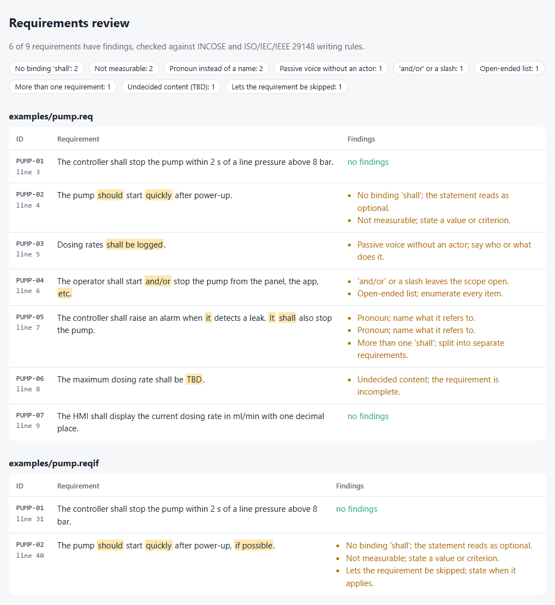
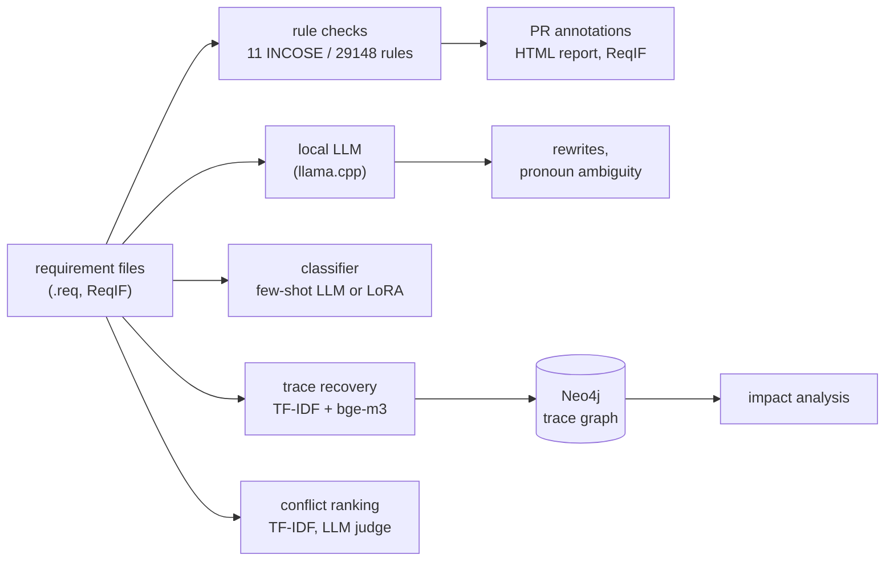
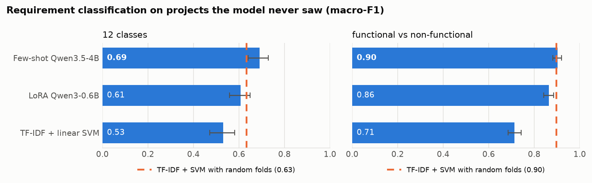
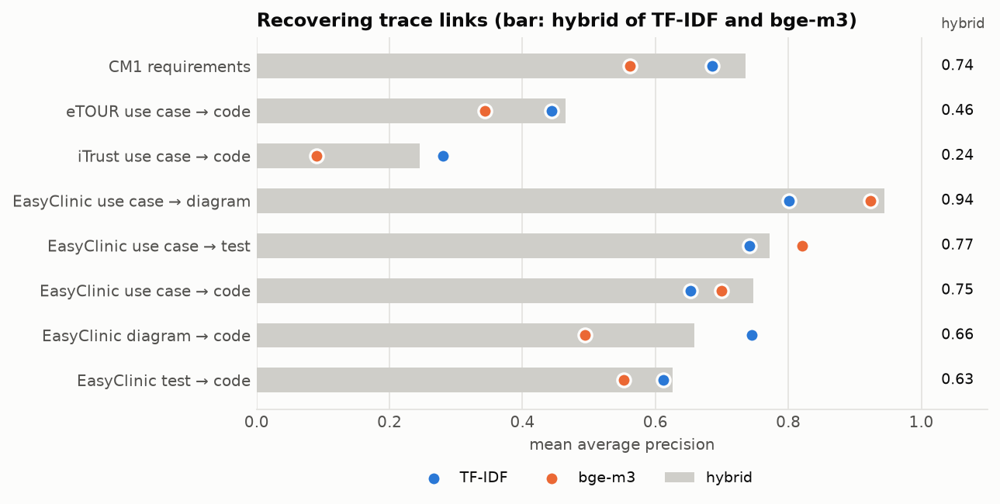

# spec-review

[](https://github.com/GBR-RL/spec-review/actions/workflows/ci.yml)
[](https://github.com/GBR-RL/spec-review/actions/workflows/requirements.yml)

Requirements as code: a reviewer for engineering requirements that runs on every pull request.

- **Quality.** It checks each requirement against INCOSE and ISO/IEC/IEEE 29148 writing rules and
  reports the findings as inline annotations. A local LLM can suggest rewrites.
- **Classification.** It labels requirements as functional or as one of eleven non-functional
  classes.
- **Traceability.** It recovers trace links between requirements, design, tests and code, and
  loads them into a graph (Neo4j) for impact analysis.
- **Conflicts.** It ranks requirement pairs by how likely they are to contradict each other.
- **ReqIF.** It reads and writes ReqIF, the exchange format of DOORS, Polarion and Jama.

Everything runs on a CPU. The LLMs are open-weight models (Qwen3.5-4B, Granite 4.2 3B) served
locally by llama.cpp, with no hosted APIs. Every component is measured on a public benchmark, and
the evaluation is built so that the numbers are not flattered: splits are grouped by project,
confidence intervals are reported, and each LLM is compared with a cheap baseline.

<picture>
  <source media="(prefers-color-scheme: dark)" srcset="docs/assets/report-dark.png">
  
</picture>

## Use it on pull requests

```yaml
# .github/workflows/requirements.yml
on: pull_request
jobs:
  review:
    runs-on: ubuntu-latest
    steps:
      - uses: actions/checkout@v4
      - uses: GBR-RL/spec-review@main
        with:
          files: "specs/**/*.req specs/**/*.reqif"
          fail-on-findings: "false"   # "true" turns findings into a failed check
          report: spec-review.html    # optional HTML report, as in the screenshot above
```

Each finding appears as an annotation on its line in the pull request diff. The job summary gets
a table of findings per file, and the action sets a `findings` output. The repository runs this
action on its own [`examples/`](examples) in
[`requirements.yml`](.github/workflows/requirements.yml).

Requirement files can be plain text, with one requirement per line and an ID such as `PUMP-02:`,
`[REQ-12]` or `REQ-12 |`, or ReqIF exported from a requirements tool.

## Command line

```bash
pip install "spec-review @ git+https://github.com/GBR-RL/spec-review"

spec-review lint examples/pump.req                    # text, json or github (--format)
spec-review report examples/pump.req -o review.html   # the HTML report
spec-review export-reqif examples/pump.req -o out.reqif   # requirements + findings as ReqIF
```

```text
examples/pump.req:4:19: weak-modal 'should': No binding 'shall'; the statement reads as optional. [PUMP-02]
examples/pump.req:4:32: vague-term 'quickly': Not measurable; state a value or criterion. [PUMP-02]
examples/pump.req:6:35: and-or 'and/or': 'and/or' or a slash leaves the scope open. [PUMP-04]
examples/pump.req:7:51: pronoun 'it': Pronoun; name what it refers to. [PUMP-05]
examples/pump.req:8:43: placeholder 'TBD': Undecided content; the requirement is incomplete. [PUMP-06]
...
9 findings in 5 of 7 requirements
```

The evaluation commands (`data`, `classify`, `trace-eval`, `conflicts-eval`, `llm-run` and so on)
reproduce the results below. `spec-review --help` lists them all.

## How it works



- **Rules** are deterministic and fast: vague terms, escape clauses ("if possible"), open-ended
  lists ("etc."), weak modals ("should"), missing modals, "and/or", placeholders ("TBD"),
  pronouns, passive voice without an actor, more than one "shall", and unanchored comparatives.
  They run in the action with no model, so a pull request is checked in seconds.
- **LLM tasks** (rewrite, pronoun ambiguity, few-shot classification, trace and conflict
  verification) use JSON-schema-constrained output from a llama.cpp server, so every answer
  parses. Benchmark runs are split into shards across parallel CPU runners
  ([`llm.yml`](.github/workflows/llm.yml)).
- **LoRA fine-tuning** of Qwen3-0.6B as a sequence classifier trains 4.6M of its 600M parameters,
  one cross-validation fold per CPU runner, in 14 to 22 minutes per fold
  ([`lora.yml`](.github/workflows/lora.yml)).
- **The trace graph** is loaded into Neo4j. Impact analysis is a variable-length Cypher query.
  The CI job runs it against a Neo4j service container and checks it against a plain-Python
  reference implementation.

## Results

All data is public and pinned by commit or SHA-256 (see [`docs/data.md`](docs/data.md)). Result
files are in [`docs/results/`](docs/results). Intervals are 95% bootstrap intervals.

### Requirement classification (PROMISE_exp)

969 requirements from 47 projects. Each method is cross-validated in five folds **grouped by
project**, so it is always tested on projects it has not seen. Requirements from one project
share templates and vocabulary, so a random split partly rewards recognising the project. The
dashed line shows how much: the same TF-IDF model scores far higher when projects are shared
between training and test folds.

<picture>
  <source media="(prefers-color-scheme: dark)" srcset="docs/assets/classification-dark.png">
  
</picture>

| method | 12 classes, macro-F1 | functional vs NFR, macro-F1 |
|---|---:|---:|
| TF-IDF + logistic regression | .486 [.430, .536] | .713 [.685, .743] |
| TF-IDF + linear SVM | .531 [.471, .582] | .714 [.686, .743] |
| LoRA Qwen3-0.6B (fine-tuned) | .607 [.559, .649] | .865 [.841, .886] |
| few-shot Qwen3.5-4B (8 nearest training examples) | **.691** [.641, .729] | **.902** [.882, .920] |
| *TF-IDF + SVM, random folds (leaky)* | *.634* | *.898* |

On unseen projects the LLMs beat TF-IDF by 15 to 19 points on functional vs non-functional.
The leak inflates TF-IDF by 10 to 18 points, which would hide most of that gap.

### Requirement quality

**Rules.** The rules flag 490 of the 969 PROMISE requirements. The most common findings are weak
modals (172), passive voice without an actor (123) and pronouns (113). There is no labelled data
for most of these rules, so their precision is not measured. They are plain pattern checks, and
each finding names the exact words that triggered it.

**Pronoun ambiguity (ReqEval).** 212 requirements, each with one pronoun labelled by several
readers as ambiguous or not (54% ambiguous). This is hard for small models.

| method (test split, 73 sentences) | accuracy | Cohen's κ |
|---|---:|---:|
| always "ambiguous" | .562 | .00 |
| Qwen3.5-4B, asked directly (all 212 sentences) | .519 | .08 |
| noun-phrase count, cut-off tuned on train | .562 | .18 |
| Qwen3.5-4B lists candidate antecedents, cut-off tuned on train | **.658** | **.30** |

Asked directly, Qwen calls only 17% of pronouns ambiguous, and Granite calls all of them
ambiguous. Asking the model to list the nouns a pronoun could refer to, and thresholding that
count, works better than asking for a verdict. Even so, κ = .30 is only fair agreement.

**LLM rewrites (Qwen3.5-4B).** The model reviewed and rewrote the 238 requirements of the PROMISE
test split, about half of which have rule findings, and the rewrites were checked again with the
rules. Version 2 of the prompt defines the issue types,
caps the number of issues, and requires numbers to be kept, with `[value]` placeholders for
values that are missing.

| | prompt v1 | prompt v2 |
|---|---:|---:|
| unusable answers | 30 / 238 | 0 / 238 |
| rule findings removed | 23% | 61% |
| flagged requirements now clean | 50% | 67% |
| rewrites that add a new finding | 32% | 14% |
| numbers kept | 83% | 91% |

Rule-clean does not mean correct. The rules cannot tell whether a rewrite kept the original
meaning, and that has not been judged here.

### Traceability (CoEST)

Eight artifact pairs from four CoEST datasets. CM1 is NASA requirements. EasyClinic has use
cases, interaction diagrams, test cases and code. eTOUR and iTrust link use cases to Java code.
Every source artifact ranks all candidate targets, and the ranking is scored by mean average
precision (MAP).

<picture>
  <source media="(prefers-color-scheme: dark)" srcset="docs/assets/traceability-dark.png">
  
</picture>

| method | mean MAP over 8 pairs |
|---|---:|
| e5-small embeddings | .540 |
| bge-m3 embeddings | .561 |
| TF-IDF | .620 |
| hybrid (TF-IDF + bge-m3, min-max normalised per artifact) | **.649** |

Dense embeddings win where both sides are prose, as with EasyClinic use cases and diagrams. On
iTrust they fail (MAP .09 to .12), because use cases and Java code share identifiers but little
natural language. TF-IDF over camelCase-split code catches those shared names, and the hybrid
keeps the strengths of both.

**Impact analysis.** The recovered links (top k per artifact) are loaded into the graph. For each
EasyClinic use case, the predicted impact is everything reachable within three hops, and it is
compared with what is reachable over the true links.

| links kept per artifact | precision | recall | predicted set size (true: 6.6) |
|---:|---:|---:|---:|
| 1 | .56 | .48 | 4.5 |
| 2 | .40 | .74 | 10.3 |
| 3 | .28 | .80 | 16.3 |
| 5 | .19 | .89 | 28.3 |

Keeping two links per artifact finds three quarters of the affected artifacts, at about 1.5 false
alarms per hit.

### Conflict detection

Labelled requirement pairs from four public document sets (UAV, WorldVista, PURE, OPENCOSS):
26,431 pairs, of which 83 conflict. Every pair in a set is ranked, and the ranking is scored by
average precision (AP).

| method | UAV | WorldVista | PURE | OPENCOSS | mean AP |
|---|---:|---:|---:|---:|---:|
| NLI contradiction (DeBERTa-v3 cross-encoder) | .12 | .03 | .05 | .10 | .072 |
| TF-IDF similarity × NLI | .73 | .39 | .19 | .10 | .355 |
| bge-m3 similarity | .94 | .71 | .91 | .33 | .722 |
| TF-IDF + Qwen3.5-4B judge on the top 50 | .92 | .90 | .93 | .21 | .738 |
| TF-IDF similarity | **.95** | .89 | .91 | .23 | **.749** |

Most conflicts in these sets are synthetic: the authors made a minimal edit to an existing
requirement, for example "current location" to "past location". Surface similarity therefore
finds them, while an off-the-shelf NLI model, trained on everyday sentences, falls far behind
plain similarity. The LLM judge does not improve on TF-IDF. On OPENCOSS, where the
conflicts are less mechanical, every method stays below .35. Similarity ranking is useful for
pointing a reviewer at candidates. Real contradiction detection is not solved here.

Duplicates are not evaluated, because the only labelled duplicate set (CDN) is proprietary.

## Data and licences

| dataset | used for | licence |
|---|---|---|
| [PROMISE_exp](https://github.com/AleksandarMitrevski/se-requirements-classification) (Lima et al. 2019) | classification, rules, rewrites | CC BY-SA 3.0 |
| [NLP4RE ReqEval](https://github.com/frieden84/nlp4re-reqeval) (2020) | pronoun ambiguity | CC BY 4.0 |
| [CoEST](http://sarec.nd.edu/coest/datasets.html): CM1, EasyClinic, eTOUR, iTrust | traceability, impact | research use, with citation |
| Malik et al. conflict sets: UAV, WorldVista, PURE, OPENCOSS | conflicts | downloaded at run time, not redistributed |

`spec-review data` and `spec-review conflicts-data` download everything from pinned sources and
check each file's SHA-256. No dataset is committed to this repository.

## Limitations

- The rules are English-only, and their precision is not measured. They target writing defects,
  not whether a requirement is right.
- Pronoun ambiguity with 3–4B models reaches only fair agreement (κ = .30), so it is not part of
  the action.
- Rewrites are scored by the rules, not by people. A rule-clean rewrite can still change the
  meaning.
- The conflict benchmarks are mostly synthetic and small (83 conflicts), and duplicates are not
  evaluated.
- All benchmark data is in English, and the datasets are 10 to 20 years old.

## Development

```bash
uv venv && uv pip install -e ".[dev]"   # extras: ml, lora, graph, charts
pytest && ruff check . && mypy src
```

CI runs linting, type checks and tests on Python 3.11 and 3.12. A Neo4j job checks the Cypher
impact query, and the repository runs its own action. The LLM, LoRA and trace-verification
benchmarks are manual workflows that run on parallel standard runners.

## Licence

MIT
